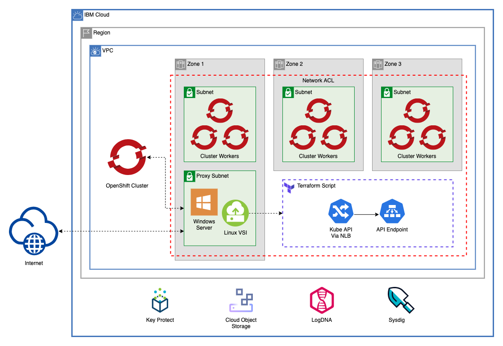

# Red Hat OpenShift on VPC With no Public Endpoint

This template creates a multizone VPC, an OpenShift cluster on that VPC, and bastion VSI on a proxy subnet to allow communication with the cluster over the private service endpoint.



-----

## Table of Contents

-----

## IBM Cloud Resources

This module creates IBM Cloud resources that exist outside of the VPC. These resources can be found in the [./resources](./resources) module.

### Resources

This module creates an IBM Cloud Object Stroage instance required for the creation of an OpenShift cluster. This module also creates a Key Protect instance and a Key Protect Root Key to encrypt the cluster. To ensure that the COS instance has access to the cluster, an authorization policy is created to allow the Key Protect instance to read from the COS instance.

### Logging and Monitoring Resources

In addition, this module creates a LogDNA instance and a Sysdig instance.

-----

## VPC

This module creates a VPC with any number of subnets across 1, 2, or 3 zones. These subnets are where the OpenShift cluster will be provisioned. It also creates a single proxy subnet where the bastion Windows and Linux VSI will be created.

The VPC resources can be found in the [multizone_vpc](/multizone_vpc) folder.

-----

### Proxy Subnet

In addition to the subnets created for the cluster, a proxy subnet is created in zone 1 by default. A public gateway is attached to this subnet to allow the VSI provisioned inside to communicate with the internet.

-----

### Access Control List

The VPC in this template uses an Access Control List to direct traffic. This traffic pattern is based on the [OpenShift VPC Network Policy Documentation](https://cloud.ibm.com/docs/openshift?topic=openshift-vpc-network-policy#acls).

The following ACL Rules are created automatically on provision:

#### Static ACL Rules

These ACL rules will be automatically created for the VPC regardless of subnet CIDR blocks:

Direction | Rule                                                          | Allow / Deny | Protocol | Source         | Source Port   | Destination   | Desination Port
----------|---------------------------------------------------------------|--------------|----------|----------------|---------------|---------------|-----------------
Inbound   | Allow Worker Nodes to be Created                              | Allow        | All      | 161.26.0.0/16  | -             | 0.0.0.0/0     | -
Inbound   | Allow communication to Services over Private Service Endpoint | Allow        | All      | 166.8.0.0/14   | -             | 0.0.0.0/0     | -
Inbound   | Allow incoming traffic requests to apps on worker nodes       | Allow        | TCP      | 0.0.0.0/0      | 30000 - 32767 | 0.0.0.0/0     | -
Inbound   | Allow load balancer and ingress app incoming traffic          | Allow        | TCP      | 0.0.0.0/0      | Any           | 0.0.0.0/0     | 443
Outbound  | Allow Worker Nodes to be Created                              | Allow        | All      | 0.0.0.0/0      | -             | 161.26.0.0/16 | -
Outbound  | Allow communication to Services over Private Service Endpoint | Allow        | All      | 0.0.0.0/0      | -             | 166.8.0.0/14  | -
Outbound  | Allow incoming traffic requests to apps on worker nodes       | Allow        | TCP      | 0.0.0.0/0      | 30000 - 32767 | 0.0.0.0/0     | -
Outbound  | Allow load balancer and ingress app incoming traffic          | Allow        | TCP      | 0.0.0.0/0      | Any           | 0.0.0.0/0     | 443

#### Dynamic ACL Rules

For each subnet in the VPC, a rule is created to allow inbound and outbound traffic from that subnet. In addition, a rule is created to allow all traffic to the proxy VSI subnet. Here is an example of the dynamically created rules using the CIDR blocks found in [variables.tf](variables.tf).

Direction | Allow / Deny | Protocol | Source         | Source Port   | Destination    | Desination Port
----------|--------------|----------|----------------|---------------|----------------|-----------------
Inbound   | Allow        | All      | 10.10.10.0/24  | -             | 0.0.0.0/0      | -
Inbound   | Allow        | All      | 10.40.10.0/24  | -             | 0.0.0.0/0      | -
Inbound   | Allow        | All      | 10.70.10.0/24  | -             | 0.0.0.0/0      | -
Inbound   | Allow        | All      | 10.100.10.0/24 | -             | 0.0.0.0/0      | -
Inbound   | Allow        | All      | 0.0.0.0/0      | -             | 10.100.10.0/24 | -
Outbound  | Allow        | All      | 0.0.0.0/0      | -             | 10.10.10.0/24  | -
Outbound  | Allow        | All      | 0.0.0.0/0      | -             | 10.40.10.0/24  | -
Outbound  | Allow        | All      | 0.0.0.0/0      | -             | 10.70.10.0/24  | -
Outbound  | Allow        | All      | 0.0.0.0/0      | -             | 10.100.10.0/24 | -
Outbound  | Allow        | All      | 10.100.10.0/24 | -             | 0.0.0.0/0      | -

#### Adding Additional Rules

The `multizone_vpc` module accepts an `acl_rules` argument that allows for the creation of additional ACL rules.

-----

### Security Group Rule

A security group rule is created for the default VPC security group to allow all inbound traffic within the VPC.

The `multizone_vpc` module accepts a `security_group_rules` argument that allows for the creation of additional rules to be added to the default VPC security group.

-----

## ROKS Cluster

This module creates a Red Hat OpenShift Cluster across all the subnets created for the [VPC](##VPC) except for the proxy subnet. This module can also dynamically create additional worker pools across the subnet. When the cluster has finished creating, the module will also install LogDNA and Sysdig agents onto the cluster.

The cluster resources can be found in the [roks_cluster](/roks_cluster) folder.

-----

### Cluster Logging and Monitoring

This module creates a resource key for the Sysdig and LogDNA resource instances created by the [resources module](##resources). These keys are used to install LogDNA and Sysdig agents onto the cluster after provision.

-----

## Bastion VSI

This module creates two VSI in the [VPC proxy subnet](###proxysubnet). A linux VSI that uses terraform to create an NLB proxy, and a Windows VSI. Both of these instances can be used to manage the OpenShift cluster.

For each VSI, a floating IP is created to allow connection from your local machine.

-----

### Linux VSI

This VSI to create an NLB Proxy to allow access to the cluster via the Private Service Endpoint. To read more about accessing the cluster through a private service endpoint refer to the [documentation here](https://cloud.ibm.com/docs/containers?topic=containers-access_cluster#access_private_se).

The virtual server by default uses the [install_terraform_vsi](./bastion_vsi/scripts/install_terraform_vsi.sh) script to install terraform, write the script inside the VSI, and run the script.

In addition, the IBM Cloud CLI, kubectl CLI, and OpenShift CLI are installed inside the VSI to test connectivity.

The VSI is created in [bastion_vsi/linux_vsi_and_nlb_proxy.tf](./bastion_vsi/linux_vsi_and_nlb_proxy.tff)

To view the code that will be installed on the VSI, refer to the [./bastion_vsi/scripts/nlb_terraform](./bastion_vsi/scripts/nlb_terraform) folder.

-----

### Windows VSI

The windows VSI uses user data to install `chocolatey` and `kubectl`. Use this script to install the IBM Cloud CLI onto your Windows instance:

```
[Net.ServicePointManager]::SecurityProtocol = [Net.SecurityProtocolType]::Tls12
iex(New-Object Net.WebClient).DownloadString('https://clis.cloud.ibm.com/install/powershell')
```

For more information on connecting to your Windows instance, read the documentation [here](https://cloud.ibm.com/docs/vpc-on-classic-vsi?topic=vpc-on-classic-vsi-connecting-to-your-windows-instance)

-----

## Architecture Variables
Variable                        | Type                                                                                 | Description                                                                                                                                                                                                                                                                                                                                                                                                                                                   | Default
------------------------------- | ------------------------------------------------------------------------------------ | ------------------------------------------------------------------------------------------------------------------------------------------------------------------------------------------------------------------------------------------------------------------------------------------------------------------------------------------------------------------------------------------------------------------------------------------------------------- |--------
TF_VERSION                      |                                                                                      | The version of the Terraform engine that's used in the Schematics workspace.                                                                                                                                                                                                                                                                                                                                                                                  | `"0.13"`
ibmcloud_api_key                | string                                                                               | The IBM Cloud platform API key needed to deploy IAM enabled resources                                                                                                                                                                                                                                                                                                                                                                                         | 
unique_id                       | string                                                                               | A unique identifier need to provision resources. Must begin with a letter                                                                                                                                                                                                                                                                                                                                                                                     | `"asset-multizone"`
ibm_region                      | string                                                                               | IBM Cloud region where all resources will be deployed                                                                                                                                                                                                                                                                                                                                                                                                         | 
resource_group                  | string                                                                               | Name of resource group where all infrastructure will be provisioned                                                                                                                                                                                                                                                                                                                                                                                           | `"asset-development"`
classic_access                  | bool                                                                                 | Enable VPC Classic Access. Note: only one VPC per region can have classic access                                                                                                                                                                                                                                                                                                                                                                              | `false`
cidr_blocks                     | object({ zone-1 = list(string) zone-2 = list(string) zone-3 = list(string) })        | An object containing lists of CIDR blocks. Each CIDR block will be used to create a subnet                                                                                                                                                                                                                                                                                                                                                                    | `{`<br>`zone-1 = [`<br>`"10.10.10.0/24" ],`<br>`zone-2 = [`<br>`"10.40.10.0/24" ],`<br>`zone-3 = [`<br>`"10.70.10.0/24" ]`<br>`}`
proxy_subnet_cidr               | string                                                                               | CIDR subnet for OpenShift Cluster Proxy. This subnet will have an attached public gateway. This subnet will be created in zone 1 of the region.                                                                                                                                                                                                                                                                                                               | `"10.100.10.0/28"`
cluster_machine_type            | string                                                                               | The flavor of VPC worker node to use for your cluster. Use `ibmcloud ks flavors` to find flavors for a region.                                                                                                                                                                                                                                                                                                                                                | `"bx2.4x16"`
workers_per_zone                | number                                                                               | Number of workers to provision in each subnet                                                                                                                                                                                                                                                                                                                                                                                                                 | `2`
disable_public_service_endpoint | bool                                                                                 | Disable public service endpoint for cluster                                                                                                                                                                                                                                                                                                                                                                                                                   | `true`
entitlement                     | string                                                                               | If you purchased an IBM Cloud Cloud Pak that includes an entitlement to run worker nodes that are installed with OpenShift Container Platform, enter entitlement to create your cluster with that entitlement so that you are not charged twice for the OpenShift license. Note that this option can be set only when you create the cluster. After the cluster is created, the cost for the OpenShift license occurred and you cannot disable this charge.   | `"cloud_pak"`
kube_version                    | string                                                                               | Specify the Kubernetes version, including the major.minor version. To see available versions, run `ibmcloud ks versions`.                                                                                                                                                                                                                                                                                                                                     | `"4.6.23_openshift"`
tags                            | list(string)                                                                         | A list of tags to add to the cluster                                                                                                                                                                                                                                                                                                                                                                                                                          | `[]`
worker_pools                    | list(object({ pool_name = string machine_type = string workers_per_zone = number })) | List of maps describing worker pools                                                                                                                                                                                                                                                                                                                                                                                                                          | `[`<br>`{`<br>`pool_name = "dev"`<br>`machine_type = "cx2.8x16"`<br>`workers_per_zone = 2`<br>`},`<br>`{`<br>`pool_name = "test"`<br>`machine_type = "mx2.4x32"`<br>`workers_per_zone = 2`<br>`}`<br>`]`
service_endpoints               | string                                                                               | Service endpoints for resource instances. Can be `public`, `private`, or `public-and-private`.                                                                                                                                                                                                                                                                                                                                                                | `"private"`
kms_plan                        | string                                                                               | Plan for Key Protect                                                                                                                                                                                                                                                                                                                                                                                                                                          | `"tiered-pricing"`
kms_root_key_name               | string                                                                               | Name of the root key for Key Protect instance                                                                                                                                                                                                                                                                                                                                                                                                                 | `"root-key"`
cos_plan                        | string                                                                               | Plan for Cloud Object Storage instance                                                                                                                                                                                                                                                                                                                                                                                                                        | `"standard"`
logdna_plan                     | string                                                                               | Plan for LogDNA                                                                                                                                                                                                                                                                                                                                                                                                                                               | `"7-day"`
sysdig_plan                     | string                                                                               | Plan for Sysdig                                                                                                                                                                                                                                                                                                                                                                                                                                               | `"graduated-tier"`
ssh_public_key                  | string                                                                               | ssh public key to use for vsi                                                                                                                                                                                                                                                                                                                                                                                                                                 | 
linux_vsi_image                 | string                                                                               | Image name used for VSI. Run 'ibmcloud is images' to find available images in a region                                                                                                                                                                                                                                                                                                                                                                        | `"ibm-centos-7-6-minimal-amd64-2"`
linux_vsi_machine_type          | string                                                                               | VSI machine type. Run 'ibmcloud is instance-profiles' to get a list of regional profiles                                                                                                                                                                                                                                                                                                                                                                      | `"bx2-8x32"`
windows_vsi_image               | string                                                                               | Image name used for VSI. Run 'ibmcloud is images' to find available images in a region                                                                                                                                                                                                                                                                                                                                                                        | `"ibm-windows-server-2012-full-standard-amd64-3"`
windows_vsi_machine_type        | string                                                                               | VSI machine type. Run 'ibmcloud is instance-profiles' to get a list of regional profiles                                                                                                                                                                                                                                                                                                                                                                      | `"bx2-8x32"`